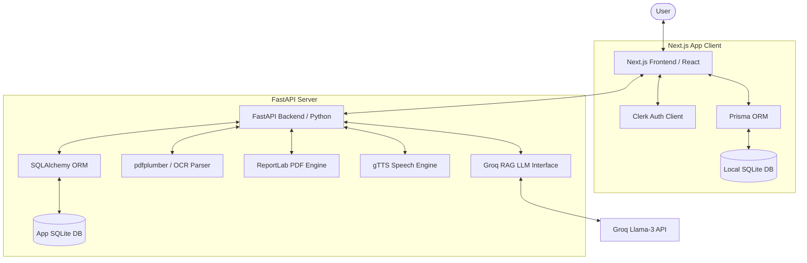
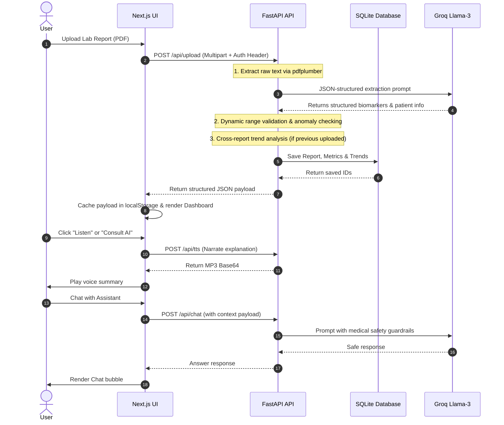

<div align="center">

# 🩺 MediLens: Health Intelligence Platform
### *Turning Clinical Lab Reports into Empathetic, Actionable Insights*

[](https://fastapi.tiangolo.com)
[](https://nextjs.org)
[](https://www.sqlite.org)
[](https://groq.com)
[](https://clerk.com)

**MediLens** is an advanced health analysis platform designed to reduce patient anxiety by transforming dense, jargon-filled laboratory diagnostic reports into clear, empathetic, and visually engaging health narratives.

</div>

---

## 🌟 Modern Health Experience

MediLens provides a premium, responsive digital environment for managing your family's health, bridging the gap between raw medical data and human understanding.

### 🎥 Feature Showcase

*   **Human-First Dashboard**: Animated **Visual Health Orbs** and status metrics instantly communicate your overall well-being.
*   **Insight Cards**: Biomarker values are translated into "What this means for you" bullet points.
*   **Family Hub**: Securely manage profiles for multiple family members in one place, ensuring histories and contexts remain separated.
*   **AI-Powered Health Assistant**: A dual-mode intelligent medical companion powered by RAG (Retrieval-Augmented Generation) supporting:
    *   *General Mode:* A strictly-guarded medical encyclopedia answering health, nutrition, and biological queries.
    *   *Contextual Mode:* Grounds itself in the selected patient report, dynamically generating suggested questions and report-specific insights.
*   **Multi-lingual Translation**: Empathic explanations available in English, Hindi (हिंदी), Tamil (தமிழ்), Telugu (తెలుగు), and Spanish (Español).
*   **Audio Narration**: Listen to your report summary using the integrated Text-to-Speech (gTTS) module.
*   **Beautiful PDF Reports**: Export elegant, doctor-ready report summaries in multiple languages.

---

## 🚀 Core Modules & Architecture

The application is structured into a decoulped Client-Server architecture utilizing:

### 1. Frontend App (`/frontend`)
Built with **Next.js (App Router)** and styled using modern, high-fidelity UI components.
- **State Management & Queries**: React Query (TanStack Query) for robust data fetching.
- **Authentication**: Fully secured with **Clerk** (OAuth & session management).
- **Database**: Local SQLite database using **Prisma ORM** for managing user profiles, patient data, and reports.

### 2. Processing Engine (`/Backend`)
A robust **FastAPI** service coordinating AI extraction, text-to-speech, and PDF generation.
- **Biomarker Extraction & OCR**: Uses `pdfplumber` to extract clinical parameters from uploaded PDFs or images.
- **RAG-Powered Insights**: Configured to query Groq's high-speed inference endpoints (Llama-3 models) using the OpenAI SDK.
- **Speech Engine**: Dynamic audio summary generation powered by `gTTS`.
- **ReportLab PDF Generator**: Creates custom summaries supporting complex multi-language scripts.

---

## 📊 System Architecture & Workflow Diagrams

### 1. High-Level System Architecture


### 2. Lab Report Analysis Workflow Sequence


---

## 🛠️ Tech Stack

- **Frontend**: Next.js (v16), React (v19), Tailwind CSS, Lucide React, Framer Motion, Recharts.
- **Authentication**: Clerk.
- **Database**: SQLite (local) via Prisma ORM; Backend supports SQLite/PostgreSQL via SQLAlchemy.
- **Backend API**: FastAPI (Python 3.10+), Uvicorn.
- **AI/LLM**: Groq Llama-3 (8B/70B) via OpenAI compatibility client.
- **Libraries**: pdfplumber, ReportLab, gTTS.

---

## ⚙️ Getting Started & Setup

### Prerequisites
- Node.js (v18+)
- Python (v3.10+)

---

### 1. Backend Setup
1. Navigate to the backend folder:
   ```bash
   cd Backend
   ```
2. Create a virtual environment and activate it:
   ```bash
   python -m venv venv
   # On Windows:
   venv\Scripts\activate
   # On macOS/Linux:
   source venv/bin/activate
   ```
3. Install dependencies:
   ```bash
   pip install -r requirements.txt
   ```
4. Create a `.env` file in the `Backend` directory:
   ```env
   GROQ_API_KEY="your_groq_api_key"
   GROK_MODEL="llama-3.1-8b-instant"
   GROK_TEMPERATURE=0.2
   GROK_MAX_TOKENS=1500
   SECRET_KEY="your_jwt_secret_key"
   DATABASE_URL="sqlite:///./app.db" # Or PostgreSQL URL

   # Clerk Keys (for JWT token verification)
   CLERK_PUBLISHABLE_KEY="your_clerk_publishable_key"
   CLERK_SECRET_KEY="your_clerk_secret_key"
   ```
5. Run the FastAPI development server:
   ```bash
   python main.py
   ```
   *The backend will run on port `8001`.*

---

### 2. Frontend Setup
1. Navigate to the frontend folder:
   ```bash
   cd frontend
   ```
2. Install dependencies:
   ```bash
   npm install
   ```
3. Create a `.env` file in the `frontend` directory:
   ```env
   NEXT_PUBLIC_API_URL="http://localhost:8001/api"
   DATABASE_URL="file:./dev.db"

   # Clerk Authentication Keys
   NEXT_PUBLIC_CLERK_PUBLISHABLE_KEY="your_clerk_publishable_key"
   CLERK_SECRET_KEY="your_clerk_secret_key"
   NEXT_PUBLIC_CLERK_SIGN_IN_URL="/login"
   NEXT_PUBLIC_CLERK_SIGN_UP_URL="/signup"
   NEXT_PUBLIC_CLERK_AFTER_SIGN_IN_URL="/dashboard"
   NEXT_PUBLIC_CLERK_AFTER_SIGN_UP_URL="/dashboard"
   ```
4. Generate the Prisma client and sync the SQLite database:
   ```bash
   npx prisma db push
   ```
5. Run the Next.js development server:
   ```bash
   npm run dev
   ```
   *The frontend will run on port `3000`.*

---

## 🔤 Multi-Language PDF Font Configuration Note
When exporting reports in Hindi, Tamil, or Telugu, `ReportLab` requires a TrueType Font (TTF) that supports complex Unicode scripts.
- **Windows**: The backend automatically locates and registers `Nirmala.ttf` (`C:\Windows\Fonts\nirmala.ttf`), which natively supports these languages.
- **Linux / Production Deployments**: Ensure a compatible font is installed and set `NIRMALA_FONT_PATH=/path/to/font.ttf` in your backend `.env` file.

---

## 🔮 Future Roadmap & Implementations
The following features are scheduled for development to enhance MediLens's clinical value and security:
1. **Multi-Point Longitudinal Health Graphs**: Expand current dual-report comparisons into full historical trend lines spanning more than two reports.
2. **Direct EHR / FHIR Integration**: Connect directly with lab systems and electronic health records utilizing HL7 FHIR protocols.
3. **Advanced Visual Highlighting on Original PDFs**: Map extracted biomarker findings back to their exact visual coordinates on the uploaded PDF.
4. **Local LLM Offline Inference**: Provide fully offline extraction using local models (e.g., Llama-3-8B via Ollama) to guarantee maximum privacy.
5. **OCR Vision Support**: Support image uploads (JPEG/PNG) directly via multimodal Vision LLMs.
6. **Medication & Appointment Reminders**: Proactive scheduling triggers based on flagged lab abnormalities.

---

## 🛡️ Privacy & Security
MediLens is designed with privacy-first principles. Lab reports are parsed locally, user profiles are segmented securely per user account, and AI interactions are strictly grounded to present explanatory medical information without replacement of professional clinical diagnosis.

---

<div align="center">
*Built with ❤️ to empower patients with knowledge and peace of mind.*
</div>
